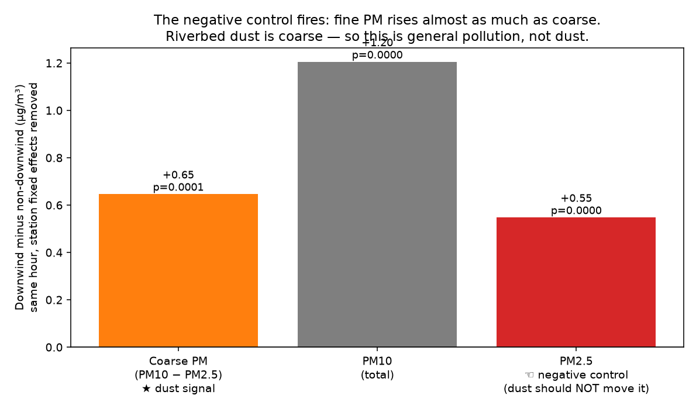
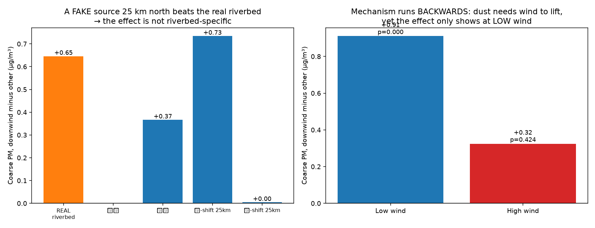

# 濁水溪河床揚塵，真的吹到下風處了嗎？

冬季濁水溪裸露河床揚塵是台灣中部熟知的空品問題。這題在文獻上幾乎空白：OpenAlex 上把「河川
低流量、裸露河床揚塵」連到「下風 PM10」的研究只有 13 篇，而且沒有一篇做台灣的濁水溪。

本專案用環境部逐時測站資料實測它。主結果顯著（p = 0.0001），然後被三道事前寫好的防線推翻，
是一份誠實的否定。



## 識別策略：同一小時、跨測站

這是本題唯一可能避開「季節同步」那類陷阱的設計：

> 同一小時內，比較位於河床下風與非下風的測站 PM10，再扣掉各測站基準。

東北季風、境外傳輸、季節、全台性汙染事件，同一小時打在所有測站上，因此被小時內比較差分掉。
同一個測站在不同小時會在下風與非下風之間切換，它自己就是自己的對照組。下風的判定，是把
「來源到測站的方位角」對上「區域向量平均風的吹向」，容差 ±45°、距離 ≤ 40 km。

## 結果：看起來成立，然後三道防線同時觸發

資料為 2025-12-01 到 2026-02-25，32 個測站，48,890 筆逐時觀測，1,643 個可比較小時。

| 檢驗 | 結果 | 判讀 |
|---|---|---|
| 粗顆粒 PM10−PM2.5（主結果） | +0.65 µg/m³，p = 0.0001 | 顯著 |
| 隨機重排安慰劑 | 經驗 p < 0.0001 | 檢定本身沒壞 |
| 一、PM2.5 陰性對照 | +0.55，p < 0.0001 | 揚塵是粗顆粒，PM2.5 卻漲得幾乎一樣多 |
| 二、北移 25 km 假來源 | +0.73，高於真來源的 0.65 | 非河床的假點，效果反而更強 |
| 三、風速機制 | 低風 +0.91（p < 0.0001）、高風 +0.32（p = 0.42） | 方向完全相反 |



其餘假來源：南移 25 km 為 +0.00（p = 0.98）、山區不顯著、海上無下風樣本。只有北移顯著，
完全符合「東北季風把北方上游汙染帶下來」的解釋。

## 真正的混淆：小時固定效果拿不掉沿風向的梯度

這是本題最值得記的一課。

小時固定效果拿掉的是區域平均水準，拿不掉沿著流向的空間梯度。東北季風下，河床下風的測站
同時也是全島上游都市與工業源、以及境外傳輸的下風，「下游什麼都比較髒」會完美偽裝成揚塵訊號。

粗顆粒指標和小時固定效果都攔不住它，只有陰性對照與位移安慰劑攔得住。效應量本身也很小
（+0.65 µg/m³，約粗顆粒均值的 3%）。

## 「事件太稀少被平均掉」這個辯解，已經被擋掉

揚塵是零星事件，所以有人會說平均效果被稀釋了。但機制檢驗直接反駁：強風時段正是揚塵該最
明顯的地方，而那裡什麼都沒有（p = 0.42）。不是樣本被稀釋，是機制不成立。

## 紀律聲明

分析腳本在看到任何結果之前就寫好，包含三道防線。資料抓完後沒有修改門檻、沒有更換指標、
沒有挑選子樣本，敏感度表把 5 組距離、角度門檻全部攤開，結論一致。

## 怎麼跑

```bash
uv venv --python 3.12 && source .venv/bin/activate
uv pip install -r requirements.txt
python run.py
```

免金鑰。首次執行抓約 14 萬筆逐時資料（142 次請求，逐批落地、可中斷續抓）。

## 資料來源（全開放）

| 資料 | 來源 |
|---|---|
| 逐時測站空品（PM10、PM2.5、風速、風向、經緯度） | 環境部 [`aqx_p_488`](https://data.moenv.gov.tw/dataset/detail/aqx_p_488) |

取用細節：現行可用的下載網址（含金鑰）由環境部公告在
[data.gov.tw 的資料集 API](https://data.gov.tw/api/v2/rest/dataset/40448) 的 `resourceDownloadUrl`
欄位。API 回應的最外層是 list 而非物件；`filters` 參數對日期無效（會靜默忽略），歷史資料要用
`offset` 分頁取得。長期使用建議自行到環境部平台註冊免費金鑰。

## 本系列

同一套混淆稽核工法，套用在不同題目上，四個誠實的案例、四種不同的推論失敗：

- [taiwan-solar-dimming](https://github.com/thc1006/taiwan-solar-dimming) — 光電 × 氣膠，死於季節同步
- [taiwan-earthquake-fab](https://github.com/thc1006/taiwan-earthquake-fab) — 地震 × 晶圓廠，死於檢定力
- **taiwan-riverbed-dust**（本專案）— 河床揚塵 × PM10，死於順風向空間梯度
- [taiwan-vre-drought](https://github.com/thc1006/taiwan-vre-drought) — 電網備轉 × 再生能源，死於會計恆等式

稽核清單見 [CONFOUND-AUDIT.md](CONFOUND-AUDIT.md)。
